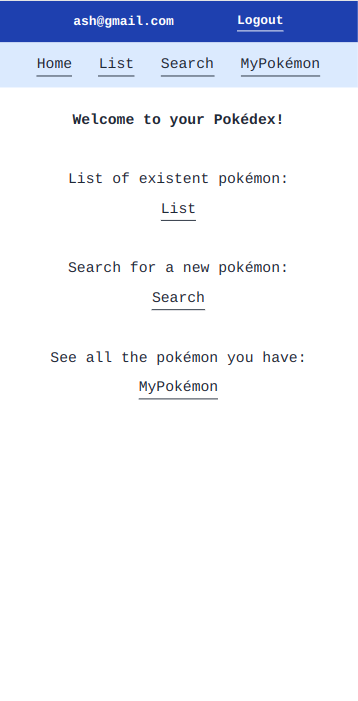
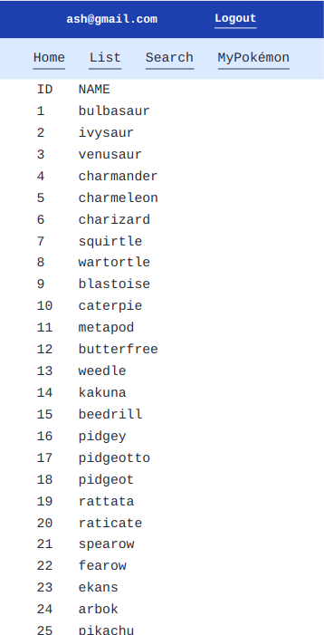
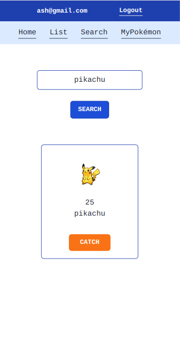
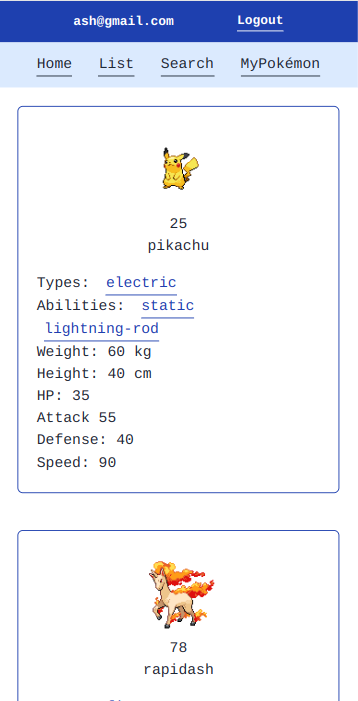

# Teste Prático Frontend Irricontrol – Luiz Casimiro

Desafio técnico realizado como parte do processo seletivo da [Irricontrol](https://irricontrol.com.br/home/). O desafio consistiu em desenvolver uma Pokédex: aplicação web que simula a busca e captura de diferentes pokémon. A aplicação foi feita com [React](https://reactjs.org/). O gerenciamento de estado global foi feto com [Redux](https://redux-toolkit.js.org/). A estilização foi feita com [TailwindCSS](https://tailwindcss.com/).


## Deploy

O deploy da aplicação foi feito na plataforma [Vercel](https://vercel.com/), e pode ser visto no link: 

```bash
   https://pokedex-luiz.vercel.app/
```


## Rodando a aplicação no seu computador

Para rodar a aplicação localmente na sua máqina, é necessário clonar o projeto e instalar suas dependências. O projeto se encontra em um [repositório remoto do github](https://github.com/luizcasimiro/pokedex-luiz). Para cloná-lo, certifique-se de que você tem o [git](https://github.com/git-guides/install-git) instalado, e então execute um dos comandos abaixo no bash (linux e mac) ou cmd/powershell (windows):

Em SSH:
```bash
  git clone git@github.com:luizcasimiro/pokedex-luiz.git
```

Em HTTPS:
```bash
  git clone https://github.com/luizcasimiro/pokedex-luiz.git
```

Depois de clonar o repositório, entre na pasta que você acabou de clonar com o comando:

```bash
  cd pokedex-luiz
```

(Aqui é importante que você se certifique de que você tem a versão mais atualizada do [NodeJS LTS](https://nodejs.org/en/). Você pode verificar a versão que você tem instalada na sua máquina digitando no bash ou cmd/powershell o comando: node --version)


Uma vez dentro da pasta, instale as dependências do projeto com o comando abaixo:

```bash
  npm install
```

Para ver a aplcação rodando, basta digitar:

```bash
  npm start
```

   
    
## API utilizada no desenvolvimento

As informações dos pokémon foram obtidas da [PokéApi](https://pokeapi.co/docs/v2). 


## Descrição das Páginas

A aplicação foi desenvolvida com cinco páginas:

- Login
- Home
- List
- Search
- MyPokémon


#### Página de Login

A página de Login recebe os inputs de email e senha. O email deve seguir a estrutura example@example.com e a senha deve ter no mínimo seis caracteres. O botão LOGIN só é habilitado caso email e senha sejam válidos. Ao clicar no botão LOGIN, o usuário é direcionado para a Home e o email é salvo no Local Storage. O email é então mostrado no Header de todas as páginas. 


#### Página Home

Nesta página, o usuário encontra informações sobre o que é possível fazer na aplicação. Ele tem a opção de ir para a página List e ver uma lista com todos os pokémon existentes; ir para a página Search e procurar por diferentes pokémon; ou ainda ir para a página MyPokémon, onde encontra seus pokémon capturados. Os botões para cada uma dessas páginas estão presentes na página Home, bem como no Header de todas as páginas.





#### Página List

Assim que esta página é renderizada, uma requisição é feita para o endpoint https://pokeapi.co/api/v2/pokemon/?offset=0&limit=1154. Este endpoint retorna, entre outras informações, um array com 1154 objetos. Cada objeto contém o nome e a url de cada um dos pokémon atualmente existentes. Estas informações são setadas no estado pokemonList. Posteriormente, estas informações são lidas pelo componente da página List, o qual renderiza uma lista com o id e o nome de cada pokémon.





#### Página Search

Aqui o usuário pode buscar por qualquer pokémon existente na página List. Ao digitar o nome ou id do pokémon no input, e clicar no botão SEARCH (o qual só é habilitado se algo for digitado no input), uma requisição é feita para o endpoint https://pokeapi.co/api/v2/pokemon/{id-or-name}/. Este endpoint retorna um objeto com todas as informações pertinentes ao pokémon buscado. Estas informações são setadas no estado pokeData. Posteriormente, estas informações são lidas pelo componente da página Search, o qual renderiza um card com a imagem, id, e nome do pokémon. Dentro do card também é renderizado o botão CATCH. Ao clicar neste botão, o pokémon buscado é “capturado”, ou seja, ele é salvo no Local Storage e posteriormente lido pelo componente da página MyPokémon.





#### Página MyPokémon

Ao renderizar, o componente da página MyPokémon lê as informações de todos os pokémon capturados no Local Storage e renderiza um card para cada pokémon com informações como imagem, id, nome, tipos, habilidades, peso, altura, hit points, ataque, defesa, e velocidade. 





## Melhorias futuras

1. Algumas funcionalidades descritas nas instruções do teste não foram implementadas, mas com certeza viriam a melhorar muito a aplicação, as quais:

a) Pokémon por tipo e habilidade: Os tipos e habilidades listados foram renderizados como botões. Uma melhoria futura seria fazer uma requisição para a PokeApi no clique de cada botão, e obter informações como todos os pokémon de cada tipo, ou efeito de cada habilidade. Endpoints a serem utilizados: https://pokeapi.co/api/v2/type/{id-or-name}/ para os tipos e https://pokeapi.co/api/v2/ability/{id-or-name}/ para as habilidades. 

b) Evolução: A PokeApi também possui informações sobre os passos de evolução de cada pokémon, as quais podem ser obtidas e renderizadas na aplicação. Endpoint a ser utilizado: https://pokeapi.co/api/v2/evolution-chain/{id}/.

2. Location Areas: Seria interessante mostrar os mapas onde os pokémon podem ser encontrados nos jogos. Endpoint a ser utilizado: https://pokeapi.co/api/v2/location-area/{id-or-name}/.

3. Diferentes idiomas: Por se tratar de uma aplicação relativamente pequena, seria possível traduzir os textos para outros idiomas.  

4. Implementação de testes: Testes apontam para a quebra de funcionalidades. Isto é importante para que nós desenvolvedores possamos estar cientes de eventuais quebras de algumas funcionalidades enquanto desenvolvemos outras. Além disso, testes exigem que nós desenvolvedores nos coloquemos no lugar do usuário e simulemos seu comportamento.   
